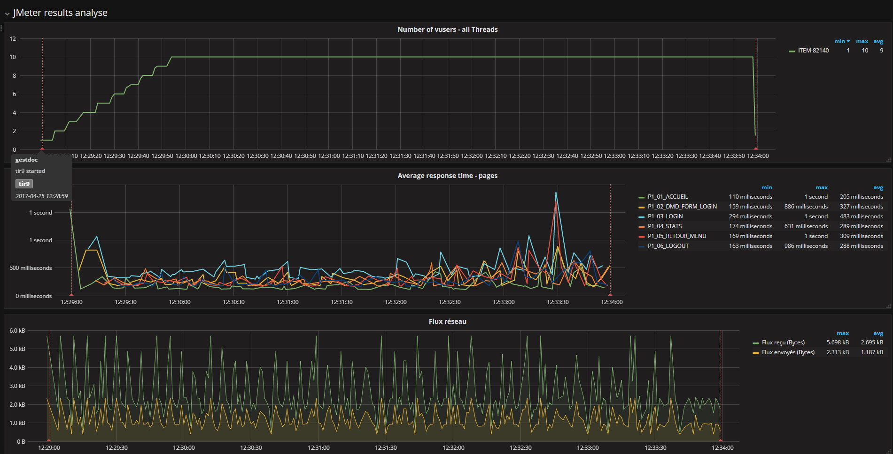
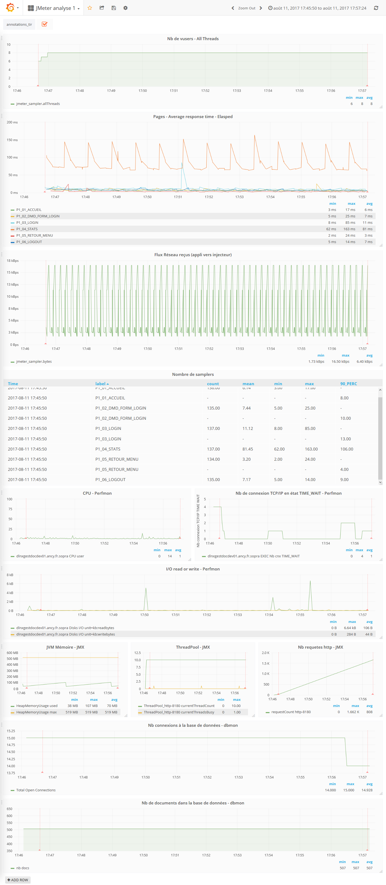

# JMeter2Influxdb

Read JMeter results in a csv file and put results in Influxdb database

The Influxdb database must be **CREATED** before import results.

The **jmeter2influxdb** tool will create
* jmeter_sampler
* jmeter_events

In the jmeter_sampler, this fields will be created if present in the csv file :
* elapsed (mandatory)
* label (mandatory)
* responseCode (mandatory)
* threadName
* success (mandatory)
* bytes (mandatory)
* sentBytes
* grpThreads
* allThreads
* Latency
* Hostname
* IdleTime
* Connect
* responseMessage (If present, try to parse responseMessage value to a long and create responseMessageLong field in InfluxDB)

and this fields will be add :
* path (file path)
* status (OK or KO)
* testLabel

Example :
```
time,Connect,Hostname,IdleTime,Latency,allThreads,application,bytes,elapsed,grpThreads,label,path,responseCode,sentBytes,status,success,testLabel,threadName
25/04/2017 10:28:59,476,ITEM-82140,122,1564,1,gestdoc,1528,1565,1,P1_01_ACCUEIL,/resultat/res2.csv,200,387,OK,True,tir9,GRP1_STATS 1-1
```

In the jmeter_events, 2 lines will be add :
* time,testLabel started
* time,testLabel ended

Example :
```
25/04/2018 10:28:59,tir9 started
25/04/2018 10:33:59,tir9 ended
```

## Commande line -help
Need Java **1.8** to run
```
usage: io.github.soprasteria.jmeterplugins.influxdb.ImportJMeterLogIntoInfluxdb -application <application> -database
       <database> -delimiter <delimiter> [-help] -influxdb_url <influxdb_url> -jmeter_file_in <jmeter_file_in> -label
       <label> [-multiply_value_by <multiply_value_by>] [-parse_response_message <parse_response_message>] [-password
       <password>] -timestamp_format <timestamp_format> [-trace_level <trace_level>] [-user <user>]
io.github.soprasteria.jmeterplugins.influxdb.ImportJMeterLogIntoInfluxdb
 -application <application>                         application name (ex : myApplication)
 -database <database>                               influxdb database name (must be CREATED before importation)
 -delimiter <delimiter>                             csv character separator corresponding to
                                                    jmeter.save.saveservice.default_delimiter in jmeter.properties
                                                    (usually , or ; or \t)
 -help                                              Help and show parameters
 -influxdb_url <influxdb_url>                       url to the influxdb (ex : http://localhost:8086)
 -jmeter_file_in <jmeter_file_in>                   JMeter results csv file in (ex res.csv)
 -label <label>                                     load test label (ex : test2)
 -multiply_value_by <multiply_value_by>             PerfMon values are multiply by 1000 so the multipy value to get the
                                                    good value is 0.001, ex 4000 x 0.001 = 4 the correct value, set
                                                    -multiply_value_by 0.001 for PerfMon results
 -parse_response_message <parse_response_message>   for JMXMon, DBMon file set to true because values are in the
                                                    reponseMessage field (default false for JMeter csv result file or
                                                    PerfMon)
 -password <password>                               password for influxdb connection
 -timestamp_format <timestamp_format>               timestamp format corresponding to
                                                    jmeter.save.saveservice.timestamp_format in jmeter.properties (ms or
                                                    Simple Date Format with ms precision)
 -trace_level <trace_level>                         trace level (WARN = defaut, INFO = good trace level, DEBUG = be
                                                    carefull very verbose)
 -user <user>                                       login for influxdb connection
Ex : java -jar jmeter2influxdb-<version>-jar-with-dependencies.jar -jmeter_file_in res.csv -timestamp_format "yyyy-MM-dd
HH:mm:ss.SSS" -delimiter ";" -influxdb_url http://localhost:8086 -user mylogin -password mypassword -database jmeterdb
-label "test2" -application "myapplication" -parse_response_message false -trace_level WARN
```


## Filtred results or XML file format
The result is not filtred, all lines are read and put in Influxdb.

If you need to filter results or the result file format is XML not CSV, the Filter Results tool could be use.

Result file for JMeter sampler results, PerfMon monitoring, JMX Monitoring, DataBase Monitoring

https://jmeter-plugins.org/wiki/FilterResultsTool/

## Import PerfMon log 
You can import monitoring log from PerfMon JMeter Plugins (Performance Monitoring with PerfMon Agent)

https://jmeter-plugins.org/wiki/PerfMon/

The monitor value is in the field _elapsed_ but the true value is = **elapsed/1000**

So use parameter : **-multiply_value_by 0.001**


## Import JMXMon log 
You can import monitoring log from JMXMon JMeter Plugins (Java Managment Extension Monitoring)

https://jmeter-plugins.org/wiki/JMXMon/

The monitor value is in the field _responseMessage_, the value is parse in long and save in the InfluxDB is the field _responseMessageLong_

For example 
In the CSV file, the field _responseMessage_ value is 10 and in the InfluxDB the field _responseMessageLong_ value is 10
In the CSV file, the field _responseMessage_ value is 4.3294864E7 and in the InfluxDB the field _responseMessageLong_ value is 43294864

Use parameter : **-parse_response_message true**
 
## Import DBMon log 
You can import monitoring log from DBMon JMeter Plugins (Data Base Monitoring) 

https://jmeter-plugins.org/wiki/DbMon/

The monitor value is in the field _responseMessage_, the value is parse in long and save in the InfluxDB is the field _responseMessageLong_

For example 
In the CSV file, the field _responseMessage_ value is 500 and in the InfluxDB the field _responseMessageLong_ value is 500

Use parameter : **-parse_response_message true**

## Show graphs results

You could use **Grafana** to display graphs

Examples : (clic on image to show full resolution image)


Results and monitoring PerfMon, JMXMon, DBMon



